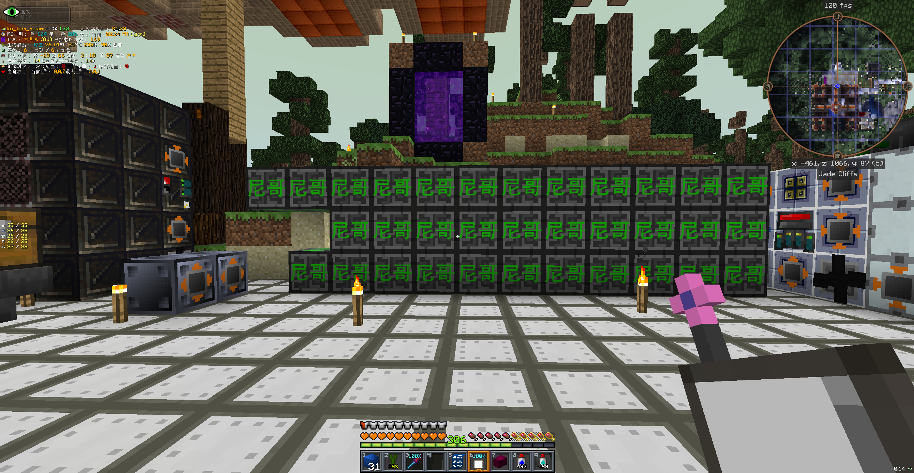
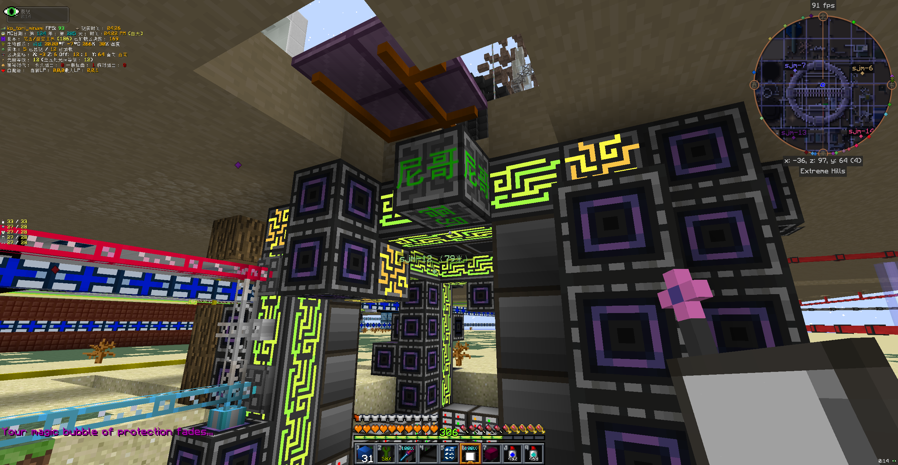
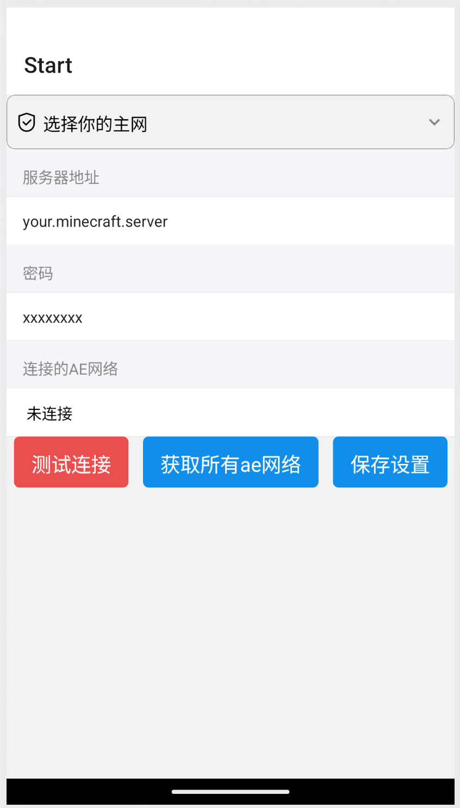
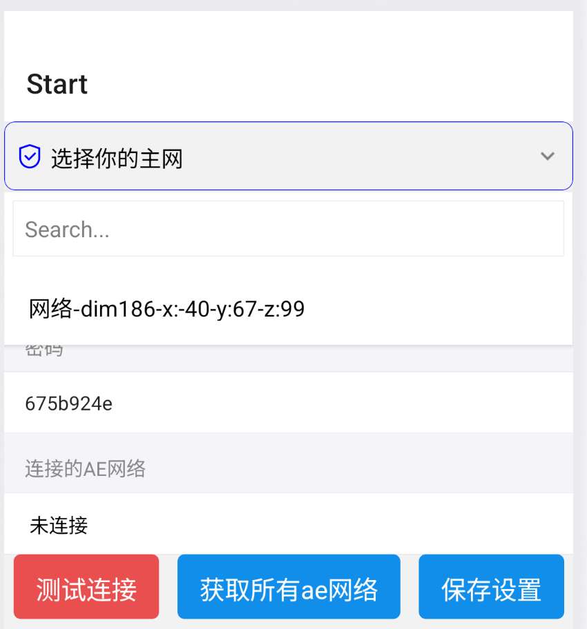
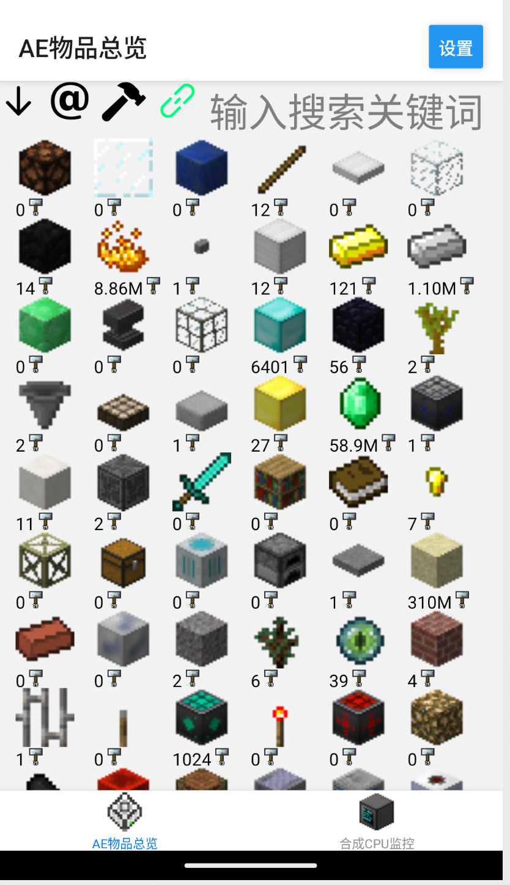
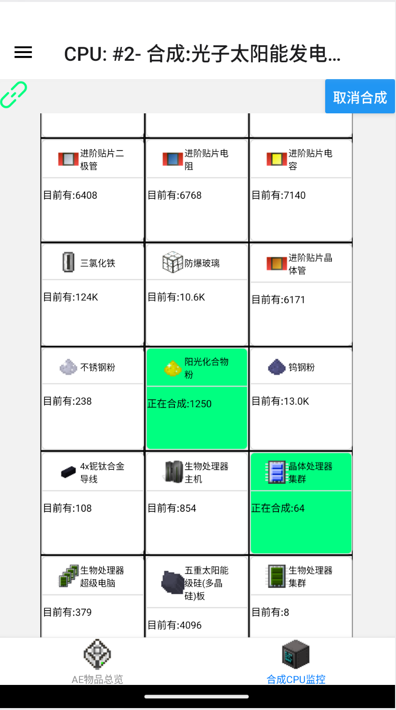
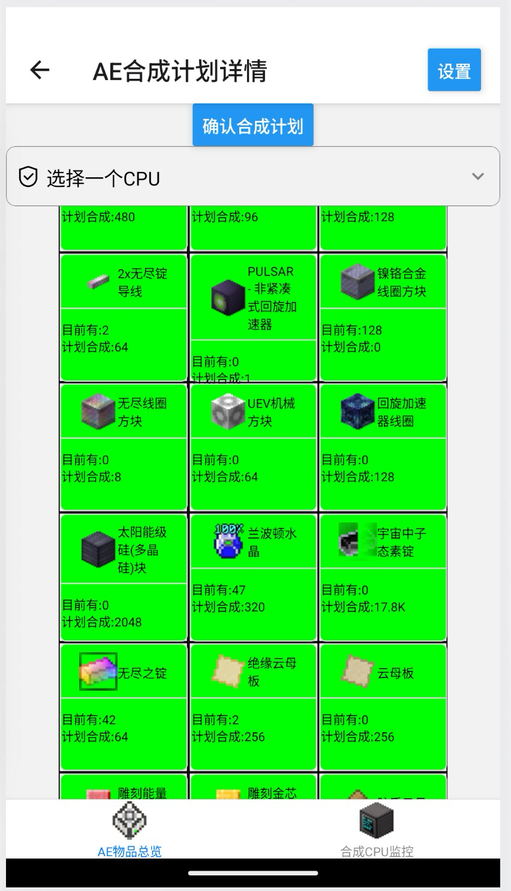

# GTNH 赛博尼哥监控手机端  
目前本APP专供GTNH，版本2.6.0，包括BoxPluxPlus和Twisted Space Technology。  
当GTNH进入无聊的挂机大后期的时候，你是否曾有过这种想法？  
"啊，要是能用网页或者手机监控服务器里面干活的电子倪哥，看他们闲了就多下几单让他们干活".  
本APP将提供该能力。  
使用该APP需要让服主在服务器安装mod.  
  
在ME控制器放下该方块后，会在聊天栏发送你的访问密码。   
  
  
APP启动界面,输入服务器地址（不带端口）和你的密码，可以点击测试连接来验证是否正确。
  
点击获取所有AE网络，然后从下拉菜单中选取你刚才放下的监控器方块坐标（一般只有一个吧，谁会监控子网啊！),之后就可以点击保存设置。  
   
主网物品，左上角按钮为正序/倒序排序，排序按modid/数量/物品名称顺序，显示可合成/所有物品，功能和AE类似。  
排序功能反应比较慢，因为主网物品太多了，可能需要在两个页面间切换来触发控件刷新，以后再想办法优化吧。  
链接图标为绿代表和服务器通信成功，红色代表断开，点击该图标可以刷新网络访问。    
可合成物品右下角有锤子标记，点进去就可以开始合成计划。  
  
合成CPU监控  
  
合成计划  
  
你可能会发现家里多了很多单元，这不是一个错误。因为GTNH NEI没有提供纹理导出的工具，所以流体只能用单元代替显示了。  